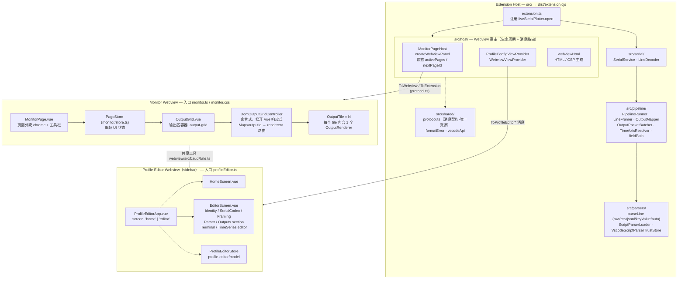
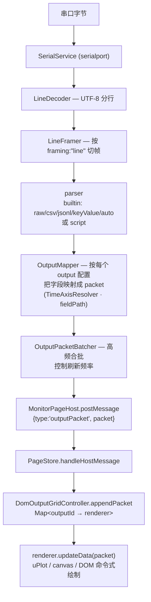
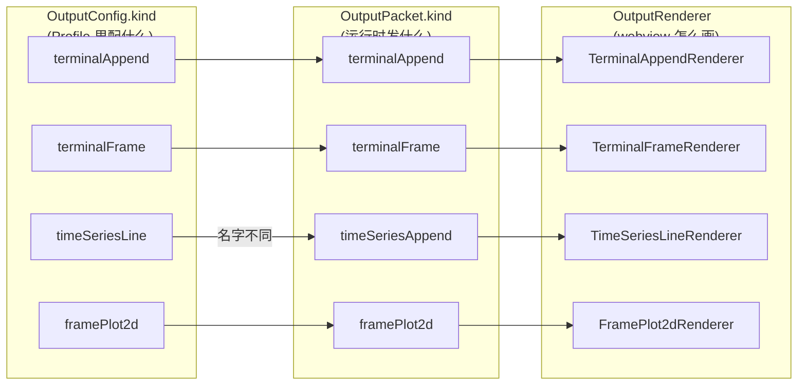
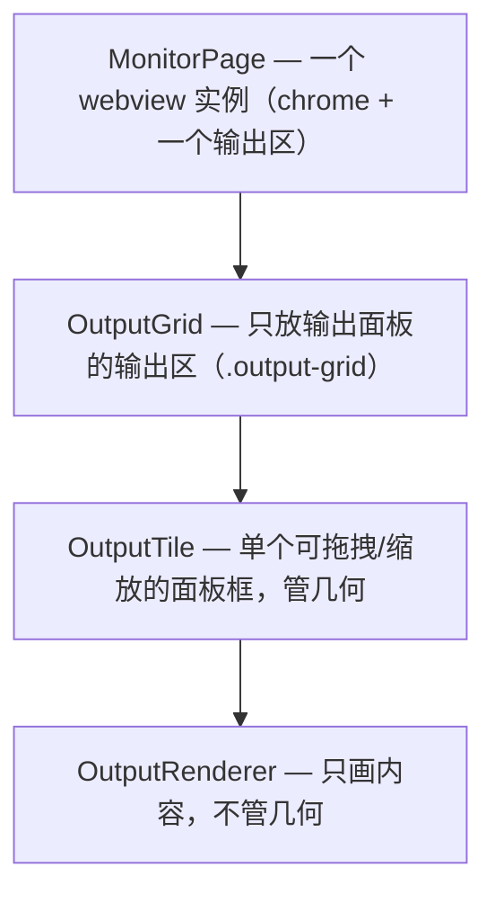

# 架构总览

本文档描述 Live Serial Plotter 的当前运行时结构、数据流水线，以及四种输出类型（output kind）之间的关系。它是**当前结构的权威说明**。迁移过程的历史审计见 [`docs/research/wayfinder-14-document-audit.md`](research/wayfinder-14-document-audit.md)，其中的旧路径和旧术语只用于历史证据。

## 1. 进程与模块结构

扩展分为一个 **Extension Host**（Node，`src/` → `dist/extension.cjs`）和两个 **Webview**（Vue 3，`webview/` → `dist/webview`）：监视页（Monitor，弹出面板）与 Profile 编辑器（sidebar）。两端只通过 `src/shared/protocol.ts` 定义的判别联合消息通信。

## 2. 数据流水线（一条串口行 → 屏幕）

高频数据（packet）在监视页由 controller 按 `outputId` 直接路由到对应 renderer 命令式绘制，**不经过 Vue 响应式**，以承受长时间高速串口输出。

## 3. 四种输出类型（Output Kind）

一份 Profile 可配置多个 output，每个 output 有一个 `kind`。`kind` 在三处严格对齐：**配置 `OutputConfig` → 运行时包 `OutputPacket` → 渲染器 `OutputRenderer`**。

| kind             | 配置类型                     | 运行时 Packet                                  | Renderer                        | 干什么                                                                     |
| ---------------- | ---------------------------- | ---------------------------------------------- | ------------------------------- | -------------------------------------------------------------------------- |
| `terminalAppend` | `TerminalAppendOutputConfig` | `terminalAppend`（追加 `lines[]`）             | `terminal/appendRenderer`       | 终端式日志，逐行**追加**，可自动滚动，`maxLines` 上限，按 level 着色       |
| `terminalFrame`  | `TerminalFrameOutputConfig`  | `terminalFrame`（按 `frameId` 的整块 `text`）  | `terminal/frameRenderer`        | 按 frameId **整帧替换**的终端块（同一帧刷新覆盖，非追加）                  |
| `timeSeriesLine` | `TimeSeriesLineOutputConfig` | `timeSeriesAppend`（追加 `samples[]`）         | `time-series/renderer`（uPlot） | 数值多通道**实时折线图**，滚动窗口（points/duration），跟随/缩放 viewState |
| `framePlot2d`    | `FramePlot2dOutputConfig`    | `framePlot2d`（按 frameId 的 `layers[]` 点集） | `frame-plot/renderer`（canvas） | 按帧渲染的 **2D 散点/点云**（每帧一组 layers，可带 bounds）                |

> ⚠️ 一处**故意的不对称**：`timeSeriesLine` 的配置 kind 与它的 packet kind（`timeSeriesAppend`）**不同名**——配置描述“这是一张折线图”，包描述“这批是追加的样本”。其余三种配置 kind 与 packet kind 同名。

### kind 的三处对齐

`rendererFactory.ts` 里的 `switch (output.kind)` 是**唯一的分派点**，配合 `assertNever(output)` 保证新增 kind 时编译期强制补齐所有分支。

## 4. 监视页概念层级

- **tile 管框、renderer 管画**：几何与内容解耦，未来栅格自由布局落在 OutputGrid/OutputTile，对 renderer 不可见。
- **controller 管路由与快照**：`DomOutputGridController` 负责 packet 路由（`appendPacket`）、布局采集（`captureLayout`）与视图状态重置，是 `OutputGridController` 端口的生产实现。
- 命名边界：`OutputGrid` **不叫 Workspace**，以避免与 `vscode.workspace` 撞名。

## 相关文档

- `AGENTS.md` — 目录职责与代码规范（当前结构权威）。
- `docs/profiles-and-pipeline.zh-CN.md` — Profile 配置与解析管线细节。
- `docs/research/wayfinder-14-document-audit.md` — 文档迁移的历史审计（不是当前来源）。
